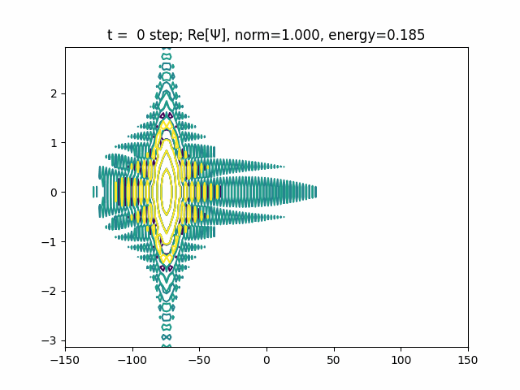

[](https://github.com/KenHino/Discvar/actions/workflows/unittest-uv.yml)

[](https://github.com/astral-sh/uv)


# Discvar


Discvar is a Python library for discrete variable representation (DVR)

## Documentation

https://kenhino.github.io/Discvar/

## Installation

### Minimum runtime
- The easiest way to install `discvar` is to use `pip`.

    For instance, prepare Python 3.10 or later and execute

    ```bash
    $ python -m venv discvar-env
    $ source discvar-env/bin/activate
    $ pip install git+https://github.com/KenHino/Discvar
    ```

### For developing
- we recommend install `pompon` from source using [`uv`](https://docs.astral.sh/uv/)

    ```bash
    $ git clone https://github.com/KenHino/Discvar.git
    $ cd Discvar
    $ uv version
    uv 0.4.18 (7b55e9790 2024-10-01)
    $ uv sync
    ```

    Then, you can execute `discvar` by
    ```bash
    $ uv run python xxx.py
    ```
    or
    ```bash
    $ souce .venv/bin/activate
    $ python
    >>> import pompon
    ```

    For jupyter notebook tutorials, you can use
    ```bash
    $ uv run jupyter lab
    ```

    ```bash
    $ cd tests/build
    $ uv run pytest ..
    ```

    You should install pre-commit hooks including ruff formatting and linting, mypy type checking, pytest testing, and so on.
    ```bash
    $ uv run pre-commit install
    $ git add .
    $ uv run pre-commit
    ```
    Before push, you must fix problems!!

    Please feel free to give us feedback or pull requests.
